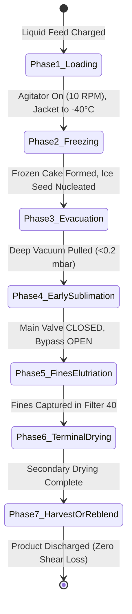

# 26: Hosokawa AFD Patent NL 2026893 B1: Translation, Claims Analysis & Engineering Evaluation

## Executive Summary & Patent Dossier

This chapter provides a comprehensive technical translation, statement-by-statement claims analysis, and mechanical engineering evaluation of Netherlands Patent **NL 2026893 B1**, entitled *"Vriesdroger en werkwijze voor vriesdrogen"* (Freeze dryer and method for freeze drying), granted to **Hosokawa Micron B.V.** on June 28, 2022 (inventors: Peter G. J. van der Wel and Olukayode I. Imole).

This patent constitutes the most significant evolutionary leap in Active Freeze Drying (AFD) technology since Hosokawa's foundational patent EP 1 601 919 B1 (2004/2005). It directly addresses the primary commercial limitation of classic conical freeze dryers: the continuous mechanical shear damage inflicted upon shear-sensitive biologics (probiotics, living cellular vaccines, enzymes, and spherical PLGA drug-delivery microspheres) caused by long-duration agitation inside the vessel.

### Official Patent Bibliographic Data

| Parameter | Official Record Specification |
| :--- | :--- |
| **Patent Number** | **NL 2026893 B1** |
| **Filing Date** | 19 October 2020 (19.10.2020) |
| **Grant Date** | 28 June 2022 (28.06.2022) |
| **Publication Date** | 28 June 2022 (28.06.2022) |
| **Patentee / Applicant** | **Hosokawa Micron B.V.** (Gildenstraat 26, 7005 BL Doetinchem, Netherlands) |
| **Inventors** | **Peter Gijsbertus Jozef van der Wel** (Doetinchem, NL)<br/>**Olukayode Idowu Imole** (Doetinchem, NL) |
| **International Filing** | **PCT/NL2021/050630** (Filing: 18.10.2021) |
| **International Publication**| **WO 2022/086326 A1** (Publication: 28.04.2022) |
| **European Patent Office** | **EP 4232777 A1** (EP Application: 21802318.2) |
| **IPC Classifications** | **F26B 5/06** (Freeze drying / lyophilization)<br/>**B01D 46/00** (Gas filtering and dust separation)<br/>**B01F 27/00** (Mixing and agitated vessel processing) |
| **Field of Invention** | Active lyophilization of shear-sensitive, fine pharmaceutical powders |

---

## 1. Paradigm Shift: EP 1 601 919 B1 vs. NL 2026893 B1

To understand the engineering necessity of NL 2026893 B1, one must compare it against the operational reality of Hosokawa's foundational AFD platform codified in EP 1 601 919 B1.

```
+-----------------------------------------------------------------------------------------+
| CLASSIC ACTIVE FREEZE DRYER (EP 1 601 919 B1)                                           |
| - Conical vessel with orbiting helical screw                                            |
| - 100% of product remains inside the cone during entire 12-24h cycle                    |
| - Constant screw contact causes shear-heating, particle attrition, and viability loss   |
| - Decreasing bed volume leaves upper jacket heat-transfer area starved and unused       |
+-----------------------------------------------------------------------------------------+
                                           |
                                           v
+-----------------------------------------------------------------------------------------+
| DYNAMIC ELUTRIATION COLLECTOR FREEZE DRYER (NL 2026893 B1)                              |
| - Conical vessel coupled to External Dynamic Collection Filter Candle (40/140)          |
| - Subliming vapor aerodynamic drag continuously elutriates dried fines out of cone      |
| - Fines collect gently on heated filter surface (70) away from rotating screw shear     |
| - Dual-mode bypass valve (30/214) isolates cake during freezing, routes dust in drying  |
| - Final cycle option: Reverse-pulse blowback returns fines for unified batch blending   |
+-----------------------------------------------------------------------------------------+
```

### The Two Fundamental Engineering Bottlenecks Solved

1. **Elimination of Shear Damage to Finished Product**:
   In standard conical vacuum dryers, wet frozen granules and dry powder co-exist in the agitated bed. As water sublimates, light dry particles become fragile. Continuous screw movement (even at low speeds of 5 to 30 RPM) subjects dry particles to wall friction, inter-particle grinding, and high-shear zones near the vessel wall clearance. For living cells (such as *Lactobacillus* or *Bifidobacterium* probiotics), shear crushes cell walls and reduces CFU survival by 2 to 4 logs. For polymer microspheres (PLGA sustained-release peptides), shear alters the spherical surface, destroying zero-order drug release kinetics. NL 2026893 B1 continuously removes dried fines the exact moment they become small and dry enough to be airborne, sheltering them in an external chamber.

2. **Mitigation of Heat Transfer Area Starvation**:
   As a batch sublimates, product density collapses and liquid water departs. In a conical geometry ($V \propto h^3$), a 50% volume loss drops the bed surface down to 79.4% of vessel height, leaving the upper cone wall empty and unable to transfer heat to the remaining frozen core. By extracting fines dynamically and maintaining active vapor circulation through heated jackets on both the cone and the collector filter column (jacket 7), thermal efficiency remains sustained across the drying plateau.

---

## 2. Statement-by-Statement Dutch to English Translation of Claims (Conclusies 1 to 27)

Below is the verified, statement-by-statement translation of the 27 patent claims from original Dutch legal syntax into English pharmaceutical engineering terminology, accompanied by technical classification and functional rationale.

### Claim 1: Primary Apparatus Claim (The Fundamental Invention)

* **Original Dutch Text**:
  > *1. Vriesdroger, omvattend:*
  > *een vriesdroogkamer met een inlaat voor het laten introduceren van te drogen materiaal in de vriesdroogkamer die is geconfigureerd om ten minste gedeeltelijk geëvacueerd te worden; en*
  > *een vacuümbron in fluïdumverbinding met de vriesdroogkamer, geconfigureerd voor het ten minste gedeeltelijk evacueren van de vriesdroogkamer, waarbij een vacuümfluïdumpad is gedefinieerd tussen de vriesdroogkamer en de vacuümbron,*
  > *waarbij de vriesdroger verder een materiaalverzamelaar omvat die is geconfigureerd voor het verzamelen van gedroogd materiaal vanuit de vriesdroogkamer, welke materiaalverzamelaarfilter is aangebracht buiten de vriesdroogkamer en binnen het vacuümfluïdumpad tussen de vriesdroogkamer en de vacuümbron.*

* **Official Technical English Translation**:
  > **1. A freeze dryer, comprising:**
  > **a freeze drying chamber having an inlet for allowing material to be dried to be introduced into the freeze drying chamber, which is configured to be at least partially evacuated; and**
  > **a vacuum source in fluid communication with the freeze drying chamber, configured for at least partially evacuating the freeze drying chamber, wherein a vacuum fluid path is defined between the freeze drying chamber and the vacuum source,**
  > **wherein the freeze dryer further comprises a material collector configured for collecting dried material from the freeze drying chamber, which material collector filter is arranged outside the freeze drying chamber and within the vacuum fluid path between the freeze drying chamber and the vacuum source.**

* **Engineering Rationale**: Defines the overarching system topology. Unlike prior art where filter candles sit inside the vessel dome (subject to cake backsplash and screw proximity), the filter candle is an autonomous external unit placed serially along the vacuum sublimation vapor highway.

---

### Claim 2: Side-by-Side Skid Architecture

* **Original Dutch Text**:
  > *2. Vriesdroger volgens conclusie 1, waarbij de materiaalverzamelaar is aangebracht naburig aan en/of naast de vriesdroogkamer.*

* **Official Technical English Translation**:
  > **2. The freeze dryer according to claim 1, wherein the material collector is arranged adjacent to and/or beside the freeze drying chamber.**

* **Engineering Rationale**: Enables cleanroom skid installations with low ceiling clearance. The filter column does not add 1.5 to 2.5 meters to the top of the vessel drive head; instead, it mounts on the adjacent skid structural frame.

---

### Claim 3: Collector Housing Partitioning & Flow Path

* **Original Dutch Text**:
  > *3. Vriesdroger volgens conclusie 1 of conclusie 2, waarbij de materiaalverzamelaar is voorzien van een vacuümuitlaat in fluïdumverbinding met de vacuümbron en een inlaat in fluïdumverbinding met de vriesdroogkamer, en een verzamelaarfluïdumpad tussen de inlaat en de uitlaat, en een verzamelinrichting die is voorzien tussen de inlaat en de uitlaat en die het verzamelaarfluïdumpad verdeelt in een eerste padgedeelte stroomafwaarts van de verzamelinrichting en een tweede padgedeelte stroomopwaarts van de verzamelinrichting.*

* **Official Technical English Translation**:
  > **3. The freeze dryer according to claim 1 or claim 2, wherein the material collector is provided with a vacuum outlet in fluid communication with the vacuum source and an inlet in fluid communication with the freeze drying chamber, and a collector fluid path between the inlet and the outlet, and a collecting device provided between the inlet and the outlet and dividing the collector fluid path into a first path section downstream of the collecting device and a second path section upstream of the collecting device.**

* **Engineering Rationale**: Establishes a pressure drop boundary ($\Delta P$) across the filter, ensuring that dust-laden vapor enters the raw gas plenum (upstream) and only clean sublimed water vapor passes to the ice condenser (downstream).

---

### Claim 4: Collecting Filter Screen Candle

* **Original Dutch Text**:
  > *4. Vriesdroger volgens conclusie 3, waarbij de verzamelinrichting een verzamelfilterscherm omvat dat is voorzien tussen de inlaat en de uitlaat en dat het verzamelaarfluïdumpad verdeelt in een eerste padgedeelte stroomafwaarts van het verzamelfilterscherm en een tweede padgedeelte stroomopwaarts van het verzamelfilterscherm.*

* **Official Technical English Translation**:
  > **4. The freeze dryer according to claim 3, wherein the collecting device comprises a collecting filter screen provided between the inlet and the outlet and dividing the collector fluid path into a first path section downstream of the collecting filter screen and a second path section upstream of the collecting filter screen.**

* **Engineering Rationale**: Specifies the porous barrier: typically a sintered stainless steel 316L or Hastelloy C-22 porous candle with pore ratings between 0.5 and 3.0 microns.

---

### Claim 5: Collector Material Discharge Port

* **Original Dutch Text**:
  > *5. Vriesdroger volgens conclusie 3 of conclusie 4, waarbij de verzamelaarbehuizing is voorzien van een materiaaluitlaat in fluïdumverbinding met het eerste padgedeelte van het verzamelaarfluïdumpad en die is geconfigureerd om het materiaal dat door de materiaalverzamelaar is verzameld te ontladen.*

* **Official Technical English Translation**:
  > **5. The freeze dryer according to claim 3 or claim 4, wherein the collector housing is provided with a material outlet in fluid communication with the first path section of the collector fluid path and configured to discharge the material collected by the material collector.**

* **Engineering Rationale**: Provides an independent drain path for powder, enabling harvest of fine dust without needing to drop it back into the main vessel cone.

---

### Claim 6: Bottom Apex Collector Outlet

* **Original Dutch Text**:
  > *6. Vriesdroger volgens één der conclusies 3-5, waarbij de verzamelaarbehuizing een bodem heeft, waarbij de materiaaluitlaat is aangebracht aan of nabij de bodem van de verzamelfilterbehuizing.*

* **Official Technical English Translation**:
  > **6. The freeze dryer according to any one of claims 3 to 5, wherein the collector housing has a bottom, wherein the material outlet is arranged at or near the bottom of the collector filter housing.**

* **Engineering Rationale**: Gravitational discharge funnel geometry prevents powder holdup or stagnant dead zones at the base of the filter candle.

---

### Claim 7: Heated Double-Walled Collector Jacket

* **Original Dutch Text**:
  > *7. Vriesdroger volgens één der conclusies 3-6, waarbij de verzamelaarbehuizing een dubbelwandige wand heeft die is geconfigureerd voor het opnemen van een verwarmingsfluïdum voor het verwarmen van fluïdum dat stroomt door het verzamelaarfluïdumpad en/of gedroogd materiaal dat is verzameld binnen de materiaalverzamelaar.*

* **Official Technical English Translation**:
  > **7. The freeze dryer according to any one of claims 3 to 6, wherein the collector housing has a double-walled jacket configured to receive a heating fluid for heating fluid flowing through the collector fluid path and/or dried material collected within the material collector.**

* **Engineering Rationale**: Essential thermodynamic protection. Under deep vacuum ($0.05$ to $0.5$ mbar), unheated steel surfaces drop below $0^\circ\text{C}$ due to radiation and sublimation vapor contact. Without the heated jacket, sublimed water vapor would re-sublime as frost on the filter candle, blinding the pores and ruining powder cake recovery.

---

### Claim 8: Dedicated Powder Receiver Vessel

* **Original Dutch Text**:
  > *8. Vriesdroger volgens één der voorgaande conclusies, omvattend een ontvanger voor verzameld materiaal, die is geconfigureerd voor het opnemen van materiaal dat is verzameld in de materiaalverzamelaar, aangebracht aan of nabij de materiaalverzamelaar.*

* **Official Technical English Translation**:
  > **8. The freeze dryer according to any one of the preceding claims, comprising a receiver for collected material configured to receive material collected in the material collector, arranged at or near the material collector.**

* **Engineering Rationale**: Isolates collected fine fractions into a secondary container (e.g., 5 L to 50 L sanitary receiving canister) that can be valved off under vacuum or inert gas.

---

### Claim 9: Receiver Body with Internal Volume

* **Original Dutch Text**:
  > *9. Vriesdroger volgens conclusie 8, waarbij de ontvanger voor verzameld materiaal een ontvangerlichaam met een ontvangerkamer heeft die daarin is gedefinieerd voor het opnemen van het verzamelde materiaal.*

* **Official Technical English Translation**:
  > **9. The freeze dryer according to claim 8, wherein the receiver for collected material has a receiver body with a receiver chamber defined therein for receiving the collected material.**

* **Engineering Rationale**: Specifies a sealed chamber retaining full vacuum integrity compatible with sterile pharma isolator transfer.

---

### Claim 10: Receiver Mated to Collector Drain

* **Original Dutch Text**:
  > *10. Vriesdroger volgens één der conclusies 3-9, wanneer afhankelijk van conclusie 5, waarbij de ontvanger voor verzameld materiaal is aangebracht aan de materiaaluitlaat voor het opnemen van verzameld materiaal vanuit de materiaalverzamelaar.*

* **Official Technical English Translation**:
  > **10. The freeze dryer according to any one of claims 3 to 9, when dependent on claim 5, wherein the receiver for collected material is attached to the material outlet for receiving collected material from the material collector.**

* **Engineering Rationale**: Direct sanitary tri-clamp or flanged bottom mating between filter bottom valve and harvest receiver.

---

### Claim 11: Heated Receiver Jacket for Moisture Stripping

* **Original Dutch Text**:
  > *11. Vriesdroger volgens één der conclusies 8-10, waarbij de ontvanger voor verzameld materiaal is geconfigureerd voor het verwarmen van verzameld materiaal dat daarin is opgevangen, waarbij bij voorkeur het ontvangerlichaam van de ontvanger voor verzameld materiaal een dubbelwandige wand heeft die is geconfigureerd voor het opnemen van een verwarmingsfluïdum en het daardoor laten circuleren van een verwarmingsfluïdum.*

* **Official Technical English Translation**:
  > **11. The freeze dryer according to any one of claims 8 to 10, wherein the receiver for collected material is configured for heating collected material received therein, wherein preferably the receiver body of the receiver for collected material has a double-walled jacket configured for receiving a heating fluid and circulating a heating fluid therethrough.**

* **Engineering Rationale**: Allows secondary drying ($+20^\circ\text{C}$ to $+40^\circ\text{C}$) to be completed inside the receiver vessel itself, reducing residual moisture to $<1.0\%$ without ever exposing powder to atmospheric moisture.

---

### Claim 12: Elevated / Top-Mounted Collector Position

* **Original Dutch Text**:
  > *12. Vriesdroger volgens conclusie 1, waarbij de materiaalverzamelaar is aangebracht op een eerste hoogte, en de vriesdroogkamer is aangebracht op een tweede hoogte, en/of waarbij de materiaalverzamelaar is voorzien bovenop en/of boven de vriesdroogkamer.*

* **Official Technical English Translation**:
  > **12. The freeze dryer according to claim 1, wherein the material collector is arranged at a first height, and the freeze drying chamber is arranged at a second height, and/or wherein the material collector is provided on top of and/or above the freeze drying chamber.**

* **Engineering Rationale**: The vertical elevation difference provides gravitational head, enabling dislodged powder to slide directly back down into the chamber if return blending is required.

---

### Claim 13: Inter-Stage Vacuum Isolation Valve

* **Original Dutch Text**:
  > *13. Vriesdroger volgens conclusie 12, omvattend een klep die is aangebracht binnen het vacuümfluïdumpad tussen de vriesdroogkamer en de materiaalverzamelaar, waarbij de klep is geconfigureerd om bewogen te worden tussen een open positie voor het toelaten van fluïdumstroom vanaf de vriesdroogkamer naar de materiaalverzamelaar, een gesloten positie voor het voorkomen van fluïdumstroom vanaf de vriesdroogkamer naar de materiaalverzamelaar, en/of een tussenpositie voor het beperken van fluïdumstroom vanaf de vriesdroogkamer naar de materiaalverzamelaar.*

* **Official Technical English Translation**:
  > **13. The freeze dryer according to claim 12, comprising a valve arranged within the vacuum fluid path between the freeze drying chamber and the material collector, wherein the valve is configured to be moved between an open position for permitting fluid flow from the freeze drying chamber to the material collector, a closed position for preventing fluid flow from the freeze drying chamber to the material collector, and/or an intermediate position for restricting fluid flow from the freeze drying chamber to the material collector.**

* **Engineering Rationale**: High-vacuum sanitary isolation valve (typically a full-bore inflatable-seal butterfly valve or spherical segment plug valve) that allows differential pressure control between vessel and filter.

---

### Claim 14: Non-Return Isolation of Collected Cake

* **Original Dutch Text**:
  > *14. Vriesdroger volgens conclusie 13, waarbij de klep het terugkeren van materiaal dat is verzameld door de materiaalverzamelaar voorkomt wanneer in de gesloten positie.*

* **Official Technical English Translation**:
  > **14. The freeze dryer according to claim 13, wherein the valve prevents the return of material collected by the material collector when in the closed position.**

* **Engineering Rationale**: Prevents sheared fines or back-pulsed powder from prematurely sliding back into the active screw agitation zone while mixing continues.

---

### Claim 15: Fine Dust Entrainment Bypass Conduit

* **Original Dutch Text**:
  > *15. Vriesdroger volgens conclusie 13 of conclusie 14, omvattend een fluïdumomleidingsleiding die is voorzien tussen de vriesdroogkamer en de materiaalverzamelaar die een omleidingsfluïdumpad voorziet tussen de vriesdroogkamer en de materiaalverzamelaar die de klep omzeilt.*

* **Official Technical English Translation**:
  > **15. The freeze dryer according to claim 13 or claim 14, comprising a fluid bypass conduit provided between the freeze drying chamber and the material collector providing a bypass fluid path between the freeze drying chamber and the material collector that bypasses the valve.**

* **Engineering Rationale**: When the main large-diameter isolation valve is closed, the bypass line (typically DN50 to DN100) forces subliming vapor through a smaller cross-sectional area, creating a controlled superficial gas velocity that entrains small dry particles into the filter while preventing large wet chunks from leaving the bed.

---

### Claim 16: Reverse Pulse Gas Purge Lance

* **Original Dutch Text**:
  > *16. Vriesdroger volgens één der voorgaande conclusies, verder omvattend een zuiveringsinlaat die is voorzien in fluïdumverbinding met het vacuümfluïdumpad, bij voorkeur stroomopwaarts van de materiaalverzamelaar, waarbij de zuiveringsinlaat is geconfigureerd om verbonden te worden met een zuiveringsbron teneinde een blaaspuls te laten verschaffen aan de materiaalverzamelaar.*

* **Official Technical English Translation**:
  > **16. The freeze dryer according to any one of the preceding claims, further comprising a purging inlet provided in fluid communication with the vacuum fluid path, preferably upstream of the material collector, wherein the purging inlet is configured to be connected to a purge source in order to provide a blow pulse to the material collector.**

* **Engineering Rationale**: High-speed reverse nitrogen pulse jet system (solenoid valves operating at 4 to 6 bar g with 50 to 200 ms pulse width) to blow cake off the porous filter candle.

---

### Claim 17: Conical Chamber with Cantilevered Screw Agitator

* **Original Dutch Text**:
  > *17. Vriesdroger volgens één der voorgaande conclusies, omvattend een in hoofdzaak conisch vat, bij voorkeur met een neerwaartse conische vorm, waarin de vriesdroogkamer is aangebracht en een roterend mengorgaan dat is aangebracht binnen de vriesdroogkamer en dat is geconfigureerd voor het agiteren van materiaal geïntroduceerd in de vriesdroogkamer.*

* **Official Technical English Translation**:
  > **17. The freeze dryer according to any one of the preceding claims, comprising a substantially conical vessel, preferably with a downward conical shape, in which the freeze drying chamber is accommodated, and a rotating mixing member arranged within the freeze drying chamber and configured for agitating material introduced into the freeze drying chamber.**

* **Engineering Rationale**: The classic Hosokawa Nauta-style inverted cone geometry with top-supported cantilevered screw (eliminating bottom seals or bearings in the product zone).

---

### Claim 18: Vessel Cover with Fluidization Gas Nozzles

* **Original Dutch Text**:
  > *18. Vriesdroger volgens conclusie 17, waarbij het in hoofdzaak conische vat een deksel omvat voor het afsluiten van een top van de vriesdroogkamer, waarbij het deksel en/of het in hoofdzaak conische vat is voorzien van één of meer blaasmondstukken met een uitlaat die is georiënteerd in de vriesdroogkamer en die zijn geconfigureerd om verbonden te worden met een gasbron.*

* **Official Technical English Translation**:
  > **18. The freeze dryer according to claim 17, wherein the substantially conical vessel comprises a cover for closing a top of the freeze drying chamber, wherein the cover and/or the substantially conical vessel is provided with one or more blow nozzles having an outlet oriented into the freeze drying chamber and configured to be connected to a gas source.**

* **Engineering Rationale**: Directed top purge nozzles sweep the upper vessel headspace, preventing cake ring formation along the upper cone knuckle and directing airborne fines toward the vapor exit.

---

### Claim 19: Normally Closed Bottom Product Discharge Valve

* **Original Dutch Text**:
  > *19. Vriesdroger volgens één der conclusies 17-18, waarbij het in hoofdzaak conische vat een vrijgeefbare uitlaat aan de bodem daarvan omvat, welke vrijgeefbare uitlaat gewoonlijk is gesloten en kan worden geopend.*

* **Official Technical English Translation**:
  > **19. The freeze dryer according to any one of claims 17 to 18, wherein the substantially conical vessel comprises a releasable outlet at the bottom thereof, which releasable outlet is normally closed and can be opened.**

* **Engineering Rationale**: Bottom spherical segment or piston valve flush with the cone apex, ensuring zero unmixed dead leg during batch processing.

---

### Claim 20: Completely Enclosed Containment Standard

* **Original Dutch Text**:
  > *20. Vriesdroger volgens één der voorgaande conclusies, waarbij alle componenten van de vriesdroger zijn ingericht om omsloten te zijn en/of om gekoppeld te zijn op een omsloten wijze.*

* **Official Technical English Translation**:
  > **20. The freeze dryer according to any one of the preceding claims, wherein all components of the freeze dryer are configured to be enclosed and/or coupled in an enclosed containment manner.**

* **Engineering Rationale**: OEB-5 / cGMP sterile containment boundary (CIP/SIP capable, helium leak tightness to $< 10^{-6}\text{ mbar}\cdot\text{L/s}$).

---

### Claim 21: Sub-Assembly Protection for Collector Unit

* **Original Dutch Text**:
  > *21. Materiaalverzamelaar voor gebruik in een vriesdroger volgens één der voorgaande conclusies.*

* **Official Technical English Translation**:
  > **21. A material collector for use in a freeze dryer according to any one of the preceding claims.**

* **Engineering Rationale**: Protects the collector filter candle unit as an independent commercial product or retrofit module for existing Hosokawa AFD dryers.

---

### Claim 22: Primary Method Claim for Dynamic Elutriation Freeze Drying

* **Original Dutch Text**:
  > *22. Werkwijze voor vriesdrogen of sublimatie van een te drogen materiaal door middel van een vriesdroger, in het bijzonder een vriesdroger volgens één der conclusies 1-20, waarbij de werkwijze de stappen omvat van:*
  > *- het introduceren van te drogen materiaal in de vriesdroogkamer van de vriesdroger; en*
  > *- het ten minste gedeeltelijk evacueren van de vriesdroogkamer door middel van de vacuümbron, om de druk binnen de vriesdroogkamer te reduceren tot of onder een vooraf bepaald drukniveau,*
  > *waarbij de werkwijze verder de stap omvat van het verzamelen van gedroogd materiaal vanuit de vriesdroogkamer door middel van een materiaalverzamelaar die is aangebracht binnen het vacuümfluïdumpad tussen de vriesdroogkamer en de vacuümbron.*

* **Official Technical English Translation**:
  > **22. A method for freeze drying or sublimation of a material to be dried by means of a freeze dryer, in particular a freeze dryer according to any one of claims 1 to 20, wherein the method comprises the steps of:**
  > **- introducing material to be dried into the freeze drying chamber of the freeze dryer; and**
  > **- at least partially evacuating the freeze drying chamber by means of the vacuum source to reduce the pressure within the freeze drying chamber to or below a predetermined pressure level,**
  > **wherein the method further comprises the step of collecting dried material from the freeze drying chamber by means of a material collector arranged within the vacuum fluid path between the freeze drying chamber and the vacuum source.**

* **Engineering Rationale**: Defines the broad operational method of simultaneous freeze-drying sublimation and continuous fines elutriation into an external collector.

---

### Claim 23: Pre-Evacuation In-Situ Freezing Step

* **Original Dutch Text**:
  > *23. Werkwijze volgens conclusie 22, omvattend de stap van het reduceren van de temperatuur binnen de vriesdroogkamer tot bij of dicht bij een bevriezingstemperatuur van het te drogen materiaal, bij voorkeur vóór de stap van het evacueren van de vriesdroogkamer.*

* **Official Technical English Translation**:
  > **23. The method according to claim 22, comprising the step of reducing the temperature within the freeze drying chamber to at or close to a freezing temperature of the material to be dried, preferably prior to the step of evacuating the freeze drying chamber.**

* **Engineering Rationale**: Codifies in-situ agitated liquid freezing (freezing via refrigerated wall jacket at atmospheric pressure under low shear) before starting the vacuum pump.

---

### Claim 24: Terminal Intermittent Gas Bleed / Venting

* **Original Dutch Text**:
  > *24. Werkwijze volgens conclusie 22 of conclusie 23, omvattend de stap van het introduceren van een gasontluchting, zoals een intermitterende gasontluchting, in de vriesdroogkamer, bij voorkeur aan of nabij het einde van het vriesdroogproces.*

* **Official Technical English Translation**:
  > **24. The method according to claim 22 or claim 23, comprising the step of introducing a gas vent, such as an intermittent gas vent, into the freeze drying chamber, preferably at or near the end of the freeze drying process.**

* **Engineering Rationale**: Controlled micro-bleed injection of dry nitrogen (0.1 to 1.0 mbar range) to promote convective heat transfer during secondary drying.

---

### Claim 25: Periodic Collector Blowback Pulse

* **Original Dutch Text**:
  > *25. Werkwijze volgens één der conclusies 22-24, omvattend de stap van het verschaffen van een terugblaaspuls over de materiaalverzamelaar, bij voorkeur periodiek.*

* **Official Technical English Translation**:
  > **25. The method according to any one of claims 22 to 24, comprising the step of providing a blowback pulse across the material collector, preferably periodically.**

* **Engineering Rationale**: Cleans filter cake resistance periodically during the run to prevent vapor choke and vacuum loss.

---

### Claim 26: Powder Re-Introduction & Final Post-Mixing

* **Original Dutch Text**:
  > *26. Werkwijze volgens één der conclusies 22-25, omvattend, aan het einde van het vriesdroogproces, de stappen van het herintroduceren van materiaal dat is verzameld door de materiaalverzamelaar in de vriesdroogkamer, en het post-mengen van het herintroduceerde materiaal en van het resterende materiaal binnen de vriesdroogkamer.*

* **Official Technical English Translation**:
  > **26. The method according to any one of claims 22 to 25, comprising, at the end of the freeze drying process, the steps of re-introducing material collected by the material collector into the freeze drying chamber, and post-mixing the re-introduced material and the remaining material within the freeze drying chamber.**

* **Engineering Rationale**: A masterstroke Hosokawa claim: by re-introducing the elutriated fines into the cone at the very end and gently running the screw for 2 to 5 minutes, the batch is 100% reconstituted into a single uniform particle size distribution with zero yield loss.

---

### Claim 27: Dynamic Valve Control Across Cycle Phases

* **Original Dutch Text**:
  > *27. Werkwijze volgens één der conclusies 22-25, waarbij de materiaalverzamelaar is aangebracht op een eerste hoogte, en de vriesdroogkamer is aangebracht op een tweede hoogte, en/of waarbij de materiaalverzamelaar is aangebracht bovenop en/of boven de vriesdroogkamer, waarbij de vriesdroger een klep omvat die is aangebracht binnen het vacuümfluïdumpad tussen de vriesdroogkamer en de materiaalverzamelaar, waarbij de klep is geconfigureerd om bewogen te worden tussen een open positie voor het toelaten van fluïdumstroom vanaf de vriesdroogkamer naar de materiaalverzamelaar, een gesloten positie voor het voorkomen van fluïdumstroom vanaf de vriesdroogkamer naar de materiaalverzamelaar, en/of een tussenpositie voor het beperken van fluïdumstroom vanaf de vriesdroogkamer naar de materiaalverzamelaar, waarbij de vriesdroger een fluïdumomleidingsleiding omvat die is voorzien tussen de vriesdroogkamer en de materiaalverzamelaar, die de klep omzeilt, waarbij de werkwijze de stappen omvat van:*
  > *- het handhaven van de klep in de open positie gedurende de vroege stadia van het vriezen en van de sublimatiefase, zodat kleine ijsdeeltjes terug in de vriesdroogkamer gerecirculeerd kunnen worden;*
  > *- en wanneer het drogen doorgaat en meer stof wordt vrijgegeven vanuit de vriesdroogkamer, het bewegen van de klep naar de gesloten positie, forcerend de stof via de omleidingsleiding naar de materiaalverzamelaar te bewegen;*
  > *- en optioneel, aan het einde van het proces of nabij het einde daarvan om de klep naar de open positie te bewegen om de verzamelde stof op de klep terug te laten keren in de vriesdroogkamer.*

* **Official Technical English Translation**:
  > **27. The method according to any one of claims 22 to 25, wherein the material collector is arranged at a first height, and the freeze drying chamber is arranged at a second height, and/or wherein the material collector is arranged on top of and/or above the freeze drying chamber, wherein the freeze dryer comprises a valve arranged within the vacuum fluid path between the freeze drying chamber and the material collector, wherein the valve is configured to be moved between an open position for permitting fluid flow from the freeze drying chamber to the material collector, a closed position for preventing fluid flow from the freeze drying chamber to the material collector, and/or an intermediate position for restricting fluid flow from the freeze drying chamber to the material collector, wherein the freeze dryer comprises a fluid bypass conduit provided between the freeze drying chamber and the material collector bypassing the valve, wherein the method comprises the steps of:**
  > **- maintaining the valve in the open position during the early stages of freezing and of the sublimation phase, such that small ice particles can be recirculated back into the freeze drying chamber;**
  > **- and as drying progresses and more dust is released from the freeze drying chamber, moving the valve to the closed position, forcing the dust to move via the bypass conduit to the material collector;**
  > **- and optionally, at or near the end of the process, moving the valve to the open position to allow the collected dust on the valve to return into the freeze drying chamber.**

* **Engineering Rationale**: Governs the complete automated state-machine sequence for PLC / SCADA integration (see Section 4 for detailed timing diagrams).

---

## 3. Engineering Numerals & Physical Subsystems Key

The drawings in NL 2026893 B1 (Figures 1A to 5) reference exact mechanical components. Below is the master engineering reference schedule:

| Reference Numeral | Engineering Description in NL 2026893 B1 | P&ID Tag in Chapter 19 | CAD Nozzle Tag in Chapter 24 |
| :--- | :--- | :--- | :--- |
| **1 / 101** | Complete freeze dryer skid system | System Skid | Base Skid Frame |
| **2 / 102** | Conical freeze drying vessel shell | V-101 | Conical Pressure Vessel |
| **3 / 103** | Internal freeze drying chamber volume | Chamber Space | Internal Volume |
| **4 / 104** | Top vessel cover / flanged dished head | Vessel Head | ASME Flanged Head |
| **5 / 105** | Cantilevered helical screw mixing member | AG-101 | Orbital Screw Assembly |
| **7 / 107** | Thermal jacket on conical vessel wall | JK-101 | Conical Dimple/Annular Jacket |
| **9 / 109** | Thermal fluid inlet/outlet ports | Nozzles N5/N6 | Supply/Return Flanges |
| **12 / 112** | Apex bottom discharge valve plug | XV-101 | Flush Bottom Ball/Spherical Valve |
| **15 / 115** | Bottom product discharge port | Nozzle N2 | Tri-Clamp Product Harvest Port |
| **16 / 116** | Cantilevered screw flighting | AG-101 Flight | Precision Ground Flighting |
| **28 / 128** | Top gearmotor drive assembly | M-101 | Orbital & Rotational Drive Motor |
| **30 / 130** | Main vapor exit port on vessel cover | Nozzle N1 | Vapor Exhaust Nozzle (DN150-DN300) |
| **34 / 134** | Inter-connecting vacuum ductwork | Line V-01 | Sanitary Vacuum Line |
| **40 / 140** | External dynamic material collector column | F-101 | Sintered Filter Candle Vessel |
| **41 / 141** | Collector column housing | F-101 Shell | Cylindrical Vessel Shell |
| **42 / 142** | Filter column heating jacket | JK-102 | Annular Heating Jacket |
| **70 / 170** | Sintered porous filter candle element | FE-101 | 0.5 to 3.0 micron Candle Screen |
| **73 / 173** | Reverse pulse gas blow lance tube | NZ-103 | Central Pulse Distribution Lance |
| **83 / 183** | Detachable fine powder receiver jar | RC-101 | Sanitary Fines Receiver Pot |
| **92 / 192** | Reverse pulse solenoid purge valves | XV-104A/B | High-Speed Pulse Jet Valves |
| **99 / 199** | CIP / SIP rotating spray balls | NZ-101A-C | Static / Rotary Spray Nozzles |
| **210** | High-velocity fines bypass conduit | Line V-02 | Fines Bypass Loop (DN50-DN80) |
| **214** | Pneumatic main vapor isolation valve | XV-102 | Inflatable-Seal Butterfly Valve |
| **216** | Vessel cover sweeping gas jet nozzles | NZ-102 | Tangential Head Purge Nozzles |

---

## 4. Operational Cycle & SCADA State Machine Integration

The operating logic disclosed in Claims 22 to 27 and Figure 4 / Figure 5 maps directly into the control architecture of Chapter 20 and the batch sequence of Chapter 21.



### Dynamic Process Timing & Valve States (FIG 5 Engineering Analysis)

```
Process Parameter / Step          Freezing      Early Sublimation    Dust Release Phase    Secondary Drying    Harvest / Blend
------------------------------------------------------------------------------------------------------------------------------
Chamber Pressure (P_chamber)      1013 mbar     0.1 to 0.3 mbar      0.05 to 0.15 mbar     0.02 to 0.05 mbar   1013 mbar (N2)
Vessel Jacket Temp (T_jacket)     -45°C         -20°C to -10°C       0°C to +15°C          +25°C to +35°C      +20°C
Collector Jacket Temp (T_filter)  Ambient       +10°C                +25°C                 +35°C               +20°C
Main Isolation Valve (214)        OPEN          OPEN                 CLOSED                CLOSED              OPEN (Re-blend)
Bypass Conduit (210)              Open / Idle   Open / Active        FORCED PATH           Open / Active       Closed
Screw Agitator (5)                5-15 RPM      10-25 RPM            8-12 RPM (Gentle)     5 RPM               10 RPM (2 min)
Reverse Pulse Solenoid (92)       OFF           OFF                  Periodic (every 5m)   Periodic            Final Blast (4 bar)
Product State                     Liquid->Ice   Bulk Sublimation     Elutriated Fines      Desorption          Homogeneous Cake
```

---

## 5. CAD Integration: Vectorized Drawings & SolidWorks Modeling Guide

The 8 drawing pages of NL 2026893 B1 have been converted to high-precision CAD DXF files located in `E:\git_desktop\patent-doc-translator-dxf-studio\dxf_exports\`:

1. `FIG_1A_skid_isometric.dxf`: Complete skid layout showing conical vessel 2, cantilevered head drive 28, external filter column 40, vacuum line 34, and bottom harvest valve 15.
2. `FIG_1B_chamber_cross_section.dxf`: Section I B - I B detailing the conical wall angle ($28^\circ$), annular jacket 7, cantilevered screw 5 with wall clearance ($3\text{ to }5\text{ mm}$), CIP spray balls 99, and apex seal 12.
3. `FIG_2A_filter_candle_elevation.dxf`: External elevation of the filter column 40 showing side vacuum entry, top gas pulse headers, and bottom receiver clamp.
4. `FIG_2B_filter_candle_cross_section.dxf`: Section II B - II B detailing the sintered filter candle 70, central purge lance 73, heating jacket 42, and lower conical discharge cone.
5. `FIG_3A_top_filter_embodiment.dxf`: Top-mounted alternative embodiment 140 mounted directly over vessel cover 104 with bypass duct 210 and return valve 214.
6. `FIG_3B_top_filter_cross_section.dxf`: Cross-sectional view through top filter showing the gravity-assisted cake drop path into vessel space 103.
7. `FIG_4_process_flowchart.dxf`: Full operational flowsheet block diagram.
8. `FIG_5_cycle_timing_diagram.dxf`: Timing waveforms for valve actuation, pressure control, and pulse cleaning.

### SolidWorks / Inventor Modeling Instructions

When importing these DXF files into SolidWorks:
1. Open SolidWorks, click **File > Open**, select the DXF file, and choose **Import to a new part as 2D sketch**.
2. Set DXF units to **Millimeters** (scale is calibrated at $0.1\times$ pixel coordinates: $2480\text{ px} = 248.0\text{ mm}$).
3. The layers are split into:
   - `OUTLINE`: Main equipment profile lines (revolve axes, vessel shell contours).
   - `DETAILS`: Internal mechanisms (screw flights, filter candles, spray nozzles).
   - `ANNOTATIONS`: Original patent reference callouts.
4. For `FIG_1B`, select the centerline entity on `OUTLINE` and use **Revolved Boss/Base** ($360^\circ$) to instantly create the primary 3D conical shell.

---

## 6. Synthesis: Why NL 2026893 B1 Must Govern Future AFD Workshop Builds

For any pharmaceutical engineering team fabricating a production or pilot-scale Active Freeze Dryer, implementing NL 2026893 B1 is not merely an optional upgrade; it is the boundary between a machine that only handles robust bulk chemicals versus a state-of-the-art lyophilizer capable of handling live biotherapeutics:

1. **CFU Survival in Probiotics**: Retaining 95%+ viable cell count by removing dry cells from screw attrition.
2. **PLGA Microsphere Integrity**: Preserving pristine spherical geometry without mechanical flattening.
3. **100% Batch Yield**: Eliminating the filter-blinding and product loss common in top-mounted internal filter bags.
4. **Thermal Optimization**: Continuous sublimation throughput facilitated by twin-jacketed heating zones.

This concludes the engineering analysis of Patent NL 2026893 B1. Chapter 26 now forms the authoritative design bridge connecting our thermodynamic equations (Chapters 02, 11) with the CAD Nozzle Schedules (Chapter 24) and the P&ID Control Loops (Chapters 19, 20).
